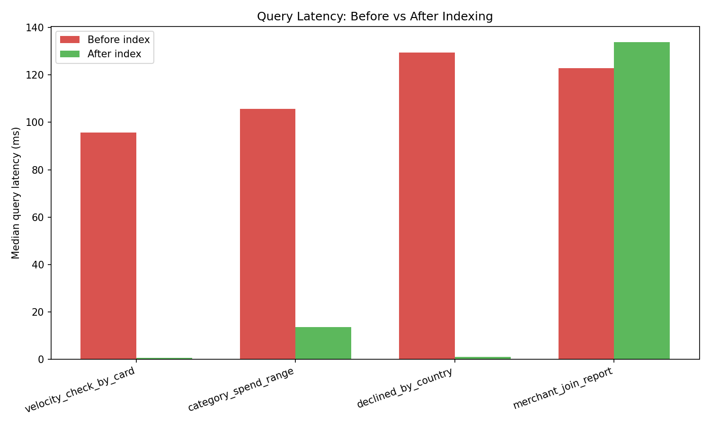

# DB Performance Benchmarking Dashboard

Benchmarks realistic payment-style queries against a synthetic transactions
dataset, before and after adding targeted indexes — with EXPLAIN ANALYZE
output and a before/after latency chart as proof.

## Why this project

Payments companies process transactions at massive scale, so query
performance directly translates to cost and latency at the customer level.
This project demonstrates:
- Designing schemas for a transactional workload
- Writing realistic OLTP/reporting queries (velocity checks, aggregations,
  joins, partial indexes)
- Reading and interpreting `EXPLAIN (ANALYZE, BUFFERS)` output
- Measuring and communicating real query-performance changes
- Understanding why indexing improves some workloads but may not benefit every query

## Setup

1. Install PostgreSQL locally (or use Docker: `docker run -d -p 5432:5432 -e POSTGRES_PASSWORD=password postgres`)
2. Create the database:
   ```bash
   createdb db_perf_benchmark
   ```
3. Install Python dependencies:
   ```bash
   pip install -r requirements.txt
   ```
4. (Optional) Set connection details via a `.env` file if they differ from
   the defaults in `scripts/db_config.py`:
   ```
   DB_HOST=localhost
   DB_PORT=5432
   DB_NAME=db_perf_benchmark
   DB_USER=postgres
   DB_PASSWORD=password
   ```

## Run it end-to-end

```bash
# 1. Create tables
psql -d db_perf_benchmark -f schema.sql

# 2. Generate synthetic data (default: 500,000 transactions)
python scripts/generate_data.py --rows 500000

# 3. Run the benchmark (drops/creates indexes, times queries, captures EXPLAIN)
python scripts/benchmark.py

# 4. Generate the chart + markdown report
python scripts/generate_report.py
```

Outputs land in `reports/`:
- `benchmark_results.json` — raw timing data
- `benchmark_chart.png` — before/after bar chart
- `BENCHMARK_REPORT.md` — full write-up with EXPLAIN references
- `*_before_explain.txt` / `*_after_explain.txt` — full query plans per scenario

## What's being tested

| Scenario | Real-world equivalent | Index type |
|---|---|---|
| `velocity_check_by_card` | Fraud velocity check ("has this card been used 5x in 5 min?") | Composite index |
| `category_spend_range` | Merchant category spend report over time | Composite index |
| `declined_by_country` | Ops dashboard for declined transactions by region | Partial index |
| `merchant_join_report` | Top-merchant revenue report | Foreign key index |

## Talking points for interviews

- **Why composite index column order matters**: in `(card_number, created_at)`,
  `card_number` comes first because it's the equality filter; `created_at`
  supports the range condition and keeps rows sorted for the scan.
- **Why a partial index for declined transactions**: most transactions are
  `APPROVED`, so indexing only `WHERE status = 'DECLINED'` keeps the index
  small and fast instead of indexing every row.
- **Caching caveat**: Postgres caches pages in shared buffers, so repeated
  runs of the same query get faster regardless of indexing. The benchmark
  runs each query 5 times and takes the median, and the EXPLAIN BUFFERS
  output tells you how many pages were read from cache vs disk — mention
  this nuance if asked how you controlled for it.
- **Next step in a real system**: at Visa's scale you wouldn't just add
  indexes — you'd also consider partitioning by date range, since old
  transactions are rarely queried but still consume index space.

## Extending this project

- Add a partitioned version of `transactions` (by month) and re-run the
  benchmark to show partitioning's effect alongside indexing.
- Swap in `pgbench` for concurrent load testing instead of single-threaded
  timing.
- Wrap `generate_report.py`'s output in a small FastAPI + HTML page for a
  live dashboard instead of a static chart.

  ## Benchmark Results

Benchmarks were run against a synthetic payment-style transactions dataset. Each query was executed 5 times and the median latency was recorded.

| Query | Before Index | After Index | Improvement |
|---|---:|---:|---:|
| `velocity_check_by_card` | 95.66 ms | 0.61 ms | **99.4%** |
| `category_spend_range` | 105.75 ms | 13.53 ms | **87.2%** |
| `declined_by_country` | 129.50 ms | 1.07 ms | **99.2%** |
| `merchant_join_report` | 122.78 ms | 133.75 ms | **-8.9%** |
### Observations

- The card-velocity query improved by 99.4% after creating a composite index on `(card_number, created_at)`

- The category-spend query improved by 87.2% using a composite index on `(merchant_category, created_at)`

- The declined-transaction query improved by 99.2% using a partial index on declined transactions

- The merchant join query became 8.9% slower after indexing (indexes are not always beneficial)

- `EXPLAIN (ANALYZE, BUFFERS)` output is captured before and after indexing to inspect the query plans and database I/O behavior

